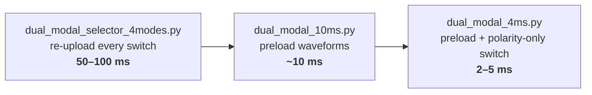
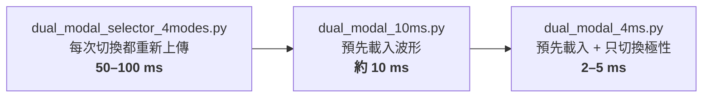

<div align="center">

# Keysight 33600A Dual-Modal Controller

Drives a piezoelectric ultrasonic motor in four directions by switching between two-channel modal waveforms on a Keysight 33600A over SCPI.


<sub>Left: Mode 1, 25 kHz · Right: Mode 2, 47 kHz · CH1 yellow, CH2 blue</sub>

</div>

<details open>
<summary><b>English</b></summary>

## Modes

| Key | Direction | Waveform pair | CH1 / CH2 polarity |
|---|---|---|---|
| 1 | Forward | 25–50 kHz | NORM / INV |
| 2 | Right | 47–94 kHz | NORM / INV |
| 3 | Backward | 25–50 kHz | INV / NORM |
| 4 | Left | 47–94 kHz | INV / NORM |

CH2 is locked to CH1 with Track On, so the two channels always stay phase-synced.

## Switching speed



For the full comparison, see [`波形切換速度優化比較分析.md`](波形切換速度優化比較分析.md) (in Chinese).

## Quick start

```bash
pip install pyvisa numpy
python dual_modal_4ms.py      # fastest, command line
python selector_gui.py        # arrow-key GUI
```

Before you run it, connect the 33600A over USB and set the VISA address in the script (`USB0::0x0957::0x5707::...`).

> [!NOTE]
> `selector_gui.py` and `dual_modal_selector_4modes.py` read `.dat` waveform files, which are git-ignored. `dual_modal_4ms.py` uses the one-period CSVs in `modal/`, so it runs straight from a fresh clone.

## Standalone Teensy controller

The Teensy 4.1 sketches drive the 33600A with no PC in the loop.

| Folder | Link |
|---|---|
| `teensy_keysight_controller/` | USB Host |
| `teensy_ethernet_keysight_controller/` | Ethernet (W5500) with static IP and Nagle off, see [`OPTIMIZATION_NOTES.md`](teensy_ethernet_keysight_controller/OPTIMIZATION_NOTES.md) |

`csv_to_c_array.py` converts the waveform CSVs into `waveform_data.h` for the firmware.

</details>

<details>
<summary><b>繁體中文</b></summary>

透過 SCPI 讓 Keysight 33600A 切換雙通道模態波形，驅動壓電超音波馬達往四個方向移動。

## 模式

| 按鍵 | 方向 | 波形組 | CH1 / CH2 極性 |
|---|---|---|---|
| 1 | 前進 | 25–50 kHz | NORM / INV |
| 2 | 右轉 | 47–94 kHz | NORM / INV |
| 3 | 後退 | 25–50 kHz | INV / NORM |
| 4 | 左轉 | 47–94 kHz | INV / NORM |

CH2 以 Track On 鎖定 CH1，兩個通道的相位永遠同步。

## 切換速度



完整比較請見 [`波形切換速度優化比較分析.md`](波形切換速度優化比較分析.md)。

## 快速開始

```bash
pip install pyvisa numpy
python dual_modal_4ms.py      # 最快，命令列版
python selector_gui.py        # 方向鍵 GUI
```

執行前，先用 USB 連接 33600A，並在程式中設定 VISA 位址（`USB0::0x0957::0x5707::...`）。

> [!NOTE]
> `selector_gui.py` 和 `dual_modal_selector_4modes.py` 讀取的 `.dat` 波形檔被 git 忽略，不在 repo 裡。`dual_modal_4ms.py` 使用 `modal/` 裡的單週期 CSV，clone 下來就能直接執行。

## Teensy 獨立控制器

Teensy 4.1 韌體可以直接控制 33600A，不需要電腦。

| 資料夾 | 連線方式 |
|---|---|
| `teensy_keysight_controller/` | USB Host |
| `teensy_ethernet_keysight_controller/` | Ethernet（W5500），固定 IP、關閉 Nagle，詳見 [`OPTIMIZATION_NOTES.md`](teensy_ethernet_keysight_controller/OPTIMIZATION_NOTES.md) |

`csv_to_c_array.py` 會把波形 CSV 轉成韌體用的 `waveform_data.h`。

</details>
